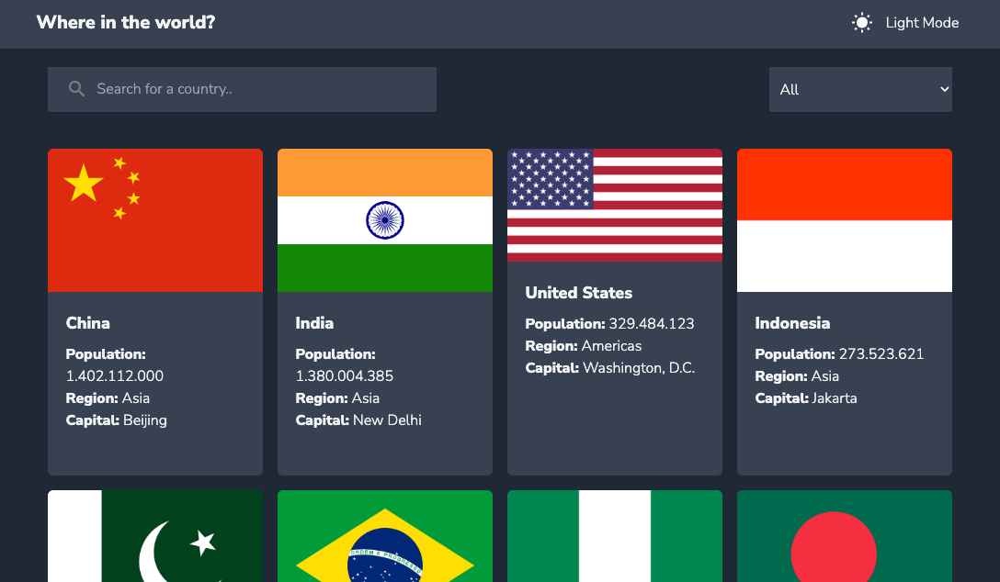

# Frontend Mentor - REST Countries API with color theme switcher solution

This is a solution to the [REST Countries API with color theme switcher challenge on Frontend Mentor](https://www.frontendmentor.io/challenges/rest-countries-api-with-color-theme-switcher-5cacc469fec04111f7b848ca). Frontend Mentor challenges help you improve your coding skills by building realistic projects.

## Overview

### The challenge

Users should be able to:

- See all countries from the API on the homepage
- Search for a country using an `input` field
- Filter countries by region
- Click on a country to see more detailed information on a separate page
- Click through to the border countries on the detail page
- Toggle the color scheme between light and dark mode _(optional)_

### Screenshot

### Links

- Solution URL: [repo](https://github.com/g1alexander/rest-countries)
- Live Site URL: [website](https://rest-countries-vue.vercel.app/)

## My process

### Built with

- vue 3
- Tailwind css

### What I learned

I learned how to handle the **composition api** of **Vue 3**, in addition to this I was able to integrate **Tailwind CSS** to the framework mentioned above, and finally in the data management I did it through **provide()** and **inject()** which works as an alternative to **Vuex**.

## Author

- Website - [g1alexander.com](https://www.g1alexander.com)
- Frontend Mentor - [@g1alexander](https://www.frontendmentor.io/profile/g1alexander)
- Twitter - [@g1alexander\_](https://www.twitter.com/g1alexander_)
